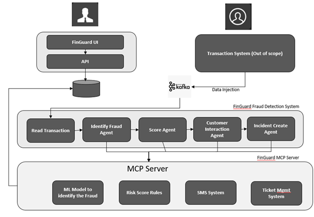

# FinGuard AI – Cognitive Transaction Monitoring & Incident Response

## Overview
FinGuard AI is an Agentic AI-powered system designed for **real-time banking transaction monitoring, fraud detection, and incident response**.  
It leverages the Model Context Protocol (MCP) for secure and structured tool integration, machine learning models for anomaly detection, and automated workflows for customer verification and fraud resolution.

---

## Architecture Overview
The architecture is divided into **three major sections**:

### 1. Transaction System (Out of Scope)
- Represents the bank’s core transaction processing system.
- Customer transactions are injected into Kafka in real time.

### 2. FinGuard Fraud Detection System
- Reads transaction data from Kafka.
- Passes transactions through multiple agents:
  - **Read Transaction Agent** – Consumes from Kafka and prepares transaction events.
  - **Identify Fraud Agent** – Applies initial rules or heuristics to filter potentially suspicious transactions.
  - **Score Agent** – Uses ML models and risk scoring rules to assign a fraud likelihood score.
  - **Customer Interaction Agent** – Sends secure SMS/Email/OTP notifications to customers for transaction verification.
  - **Incident Create Agent** – Logs the incident in a ticketing system for tracking and compliance.

### 3. FinGuard MCP Server
- Hosts the backend tools accessible to agents.
- Tools include:
  - **ML Model Tool** – Predicts the fraud risk score.
  - **Risk Score Tool** – Applies policy and scoring logic.
  - **SMS Tool** – Sends secure customer notifications.
  - **Ticket Management Tool** – Creates and manages incident records.

---

## Data Flow
1. **Transaction Ingestion** – Customer performs a transaction; details are pushed into Kafka.
2. **Transaction Read** – Read Transaction Agent consumes from Kafka and passes events downstream.
3. **Fraud Detection** – Identify Fraud Agent and Score Agent evaluate the transaction.
4. **Customer Verification** – If the risk score exceeds a threshold, Customer Interaction Agent sends a verification request to the customer.
5. **Incident Logging** – Incident Create Agent logs the ticket in the ticketing system.
6. **Outcome Handling** – Actions are taken (allow, block, or freeze account) based on the customer’s response and fraud policy.

---

## Key Features
- **Real-time monitoring** via Kafka/MSK.
- **Agent-based architecture** for modular functionality.
- **MCP integration** for secure and standardized tool access.
- **Machine Learning-based scoring** for adaptive fraud detection.
- **Automated customer verification** for faster resolution.
- **Incident management** with full audit trails.

---

## Benefits
- Faster incident resolution and reduced fraud losses.
- Improved detection accuracy with lower false positives.
- Enhanced customer trust via proactive communication.
- Reduced workload for customer service teams.

---

## Deployment (Example: AWS)
- **MSK  (Kafka) or Custom installed ** for real-time streaming.
- **EC2** for agents.
- **API Gateway** for UI/API integration.
- **RDS (Mongo)** for case and incident data.
- **CloudWatch** for logging and monitoring.

---

## Projects
 
 
.
├── Agent/ # MCP Agent implementations

├── MCP Tools/ # MCP Tool definitions (ML, Risk, SMS, Ticket)

├── API/ # ML models for fraud detection

├── ui/ # Frontend components

├── infra/ # Infrastructure as code (IaC) templates

├── tests/ # Unit and integration tests

└── README.md # Project documentation 

## Proposed Architecture

